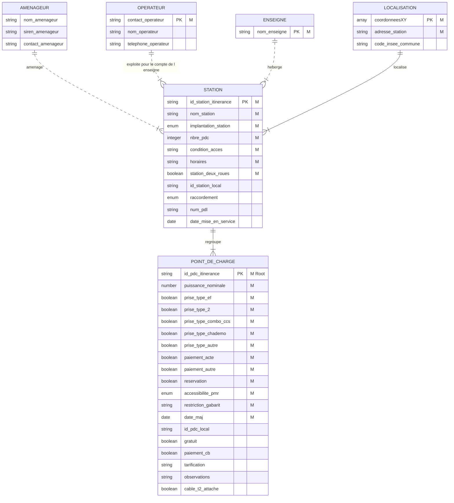

# Analyse de l'intégrité du jeu de données IRVE

## 1 - Objectif
Le [jeu de données IRVE](https://doc.transport.data.gouv.fr/producteurs/infrastructures-de-recharge-de-vehicules-electriques-irve) est un jeu de données complexe avec un processus de production et de consolidation des données spécifique.     
Il fait l'objet également de [questions](https://www.data.gouv.fr/fr/datasets/5448d3e0c751df01f85d0572/#/discussions) concernant l'intégrité des données.    
    
L'étude présentée ici a pour objectif de faciliter la réutilisation des données grace d'une part à une meilleure compréhension de la structure des données et d'autre part à une amélioration du niveau de qualité des données.

## 2 - Données IRVE
Les données IRVE sont décrites dans le [schéma de données](https://schema.data.gouv.fr/etalab/schema-irve-statique/2.2.0/documentation.html) mis à disposition. Celui-ci décrit chacun des champs qui le compose.      
Par contre, il ne décrit pas la structure globale des données qui permet de comprendre les relations qui existent entre chaque champs.    
    
Le modèle de données ci-dessous identifie les principales entités que décrivent les champs et les relations entre celles-ci (station en itinerance uniquement):

*Notation:*
- *M : Mandatory - documentation obligatoire*
- *PK : Primary Key - identifiant unique de l'entité*
- *Root : champ fictif associé à une ligne du tableau*

Les relations exprimées dans ce modèle permettent de déduire les règles d'intégrité qui sont à respecter pour obtenir un jeu de données cohérent.    
    
*Par exemple :*
- *un point de recharge (pdc) est unique et correspond à une ligne du tableau*
- *un pdc est représenté par le champ 'id_pdc_itinerance'*
- *un pdc est associé à une et une seule station (représentée par le champ 'id_station_itinerance')*
- *une station est associée à une et une seule localisation (représentée par le champ 'coordonneesXY')*    
    
Douze règles ont ainsi été retenues pour valider l'intégrité du jeu de données.

## 3 - Etat des lieux
L'état des lieux décrit ici correspond au jeu de données du 03/03/2023.    
    
Il contient 51 000 lignes dont 50 000 associées à des pdc en itinerance et correspondant à 18 500 stations.   
    
L'application des règles d'intégrité permet d'identifier un **faible** niveau d'intégrité du jeu de données (pour les 12 règles retenues) :
- 32 000 lignes respectent les règles
- 18 000 lignes présentent un ou plusieurs écarts
    
Ce faible niveau justifie les [questions posées](https://www.data.gouv.fr/fr/datasets/5448d3e0c751df01f85d0572/#/discussions).   
    
Deux raisons principales expliquent ce niveau :
- Les règles d’intégrité ne sont ni exprimées dans le schéma de données ni contrôlées au cours du processus de consolidation.
- Le processus de mise à jour des données laisse la possibilité de conserver les anciennes versions qui génèrent des incohérences.

## 4 - Mise en cohérence des données
Le principal écart identifié dans l'analyse correspond au non respect de la règle d'unicité des pdc (16 000 lignes).     
Après élimination des 8 300 doublons (identifiés par le champ 'date_maj'), le nombre de lignes en écart tombe à 2 170.    
    
Un deuxième écart, lié au précédent, correspond à la présence d'anciens pdc dans une station qui a été mise à jour.    
La suppression de ces 380 anciens pdc permet alors de réduire le nombre de pdc en écart à 1 610.    
    
Après ces deux opérations, le jeu de données "nettoyé" des anciens pdc comporte 42 000 pdc associées à 18 500 stations.     
Parmi ces 42 000 pdc, 1 600 présentent des écarts par rapport aux règles retenues soit un taux de 3,8 %.

