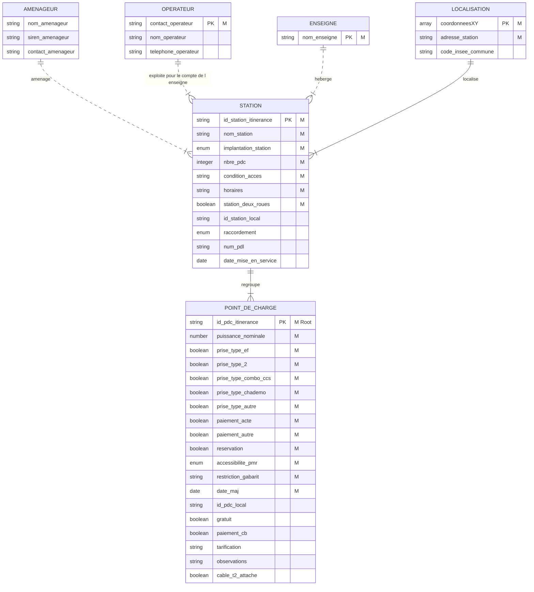

# Analyse de l'intégrité du jeu de données IRVE
----------------
## Objectif
Le [jeu de données IRVE](https://doc.transport.data.gouv.fr/producteurs/infrastructures-de-recharge-de-vehicules-electriques-irve) est un jeu de données complexe avec un processus de production et de consolidation des données spécifique.     
Il fait l'objet également de questions concernant [l'intégrité des données](https://www.data.gouv.fr/fr/datasets/5448d3e0c751df01f85d0572/#/discussions). 
L'étude présentée ici a pour objectif de faciliter la réutilisation des données grace d'une part à une meilleure compréhension de la structure des données et d'autre part à une amélioration du niveau de qualité des données.

## Données IRVE
Les données IRVE sont décrites dans le [schéma de données](https://schema.data.gouv.fr/etalab/schema-irve-statique/2.2.0/documentation.html) mis à disposition. Celui-ci décrit chacun des champs qui le compose.    
Par contre, il ne décrit pas la structure globale des données qui permet de comprendre les relations qui existent entre chaque champs. Le modèle de données ci-dessous identifie les principales entités que décrivent les champs et les relations entre celles-ci :

*Notation:*
- *M : Mandatory - documentation obligatoire*
- *PK : Primary Key - identifiant unique de l'entité*
- *Root : champ fictif associé à une ligne du tableau*

